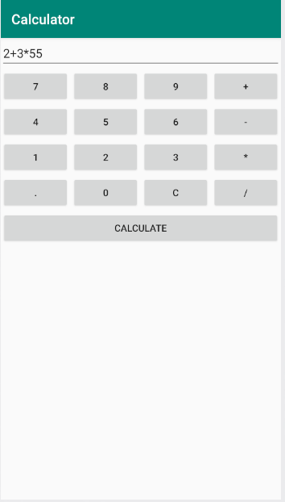
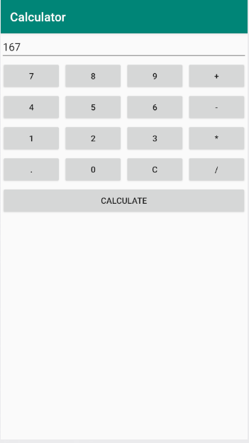
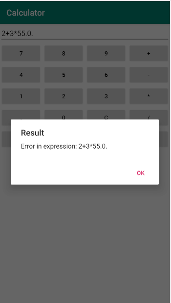

# simple-calculator-python-beeware-android

Beeware test (python framework) in a simple calculator implementation for android:

Problems:

1. Didn't find how to change the minimum width of buttons in flex mode (a set of several buttons can overlap parent windows).
2. Didn't find how to change the cursor position in TextInput:
3. Font size in android is unchanged (in my case under Windows 10 with python 3.8).

# Author Alexander V. Korovin [a.v.korovin73@gamil.com]
